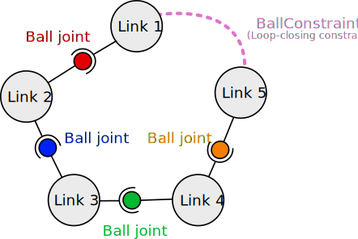

# Joint constraints and multibodies
One of the most appealing features of a physics engine is to simulate articulations. Articulations, aka. _joints_, allow the restriction of the motion of one body part relative to another. For example, one well-known joint is the ball-in-socket joint also known as the ball joint: it allows one object to rotate freely with regard to the other but not to translate. This is typically used to simulate the shoulder of a ragdoll.

## Fundamental concepts

Joints can be modeled in various ways but let's talk about the concept of **Degrees Of Freedom (DOF)** first. In 3D, a rigid-body is capable of translating along the 3 coordinates axises $\mathbf{x}$, $\mathbf{y}$ and $\mathbf{z}$, and to rotate along those three axises as well. Therefore, a rigid-body is said to have  **3 translational DOF** and **3 rotational DOF**. We can also say a 3D rigid-body has a total of **6 DOF**. The 2D case is similar but with less possibilities of movements: a 2D rigid-body has 2 translational DOF and only 1 rotational DOF (which forms a total of 3 DOF). The number of **relative DOF** of a body part wrt. another body part is the number of possible relative translations and rotations.

!!! Note
    The `BodyHandle::ground()` on the other hand cannot move at all. Therefore it has 0 DOFs. Moreover a [multibody](#multibodies) has a number of DOF equal to the sum of the number of DOF of its multibody links.

!!! Warning
    The number of DOF of a body or body part can be retrieved by `body.ndofs()`. The [status](/rigid_body_simulations_with_contacts/#rigid-body-statuses) of a body (dynamic, static, kinematic) does not affect the result of `body.ndofs()` even if strictly speaking a static or kinematic body should be seen as having no DOF (because it cannot move freely wrt. any axis). The `body.status_dependent_ndofs()` method will take this body status into account and return 0 for static and kinematic bodies.

The goal of a joint is to reduce the number of DOF a body part has. For example, the aforementioned ball joint removes all relative translations between two body parts. Therefore, it allows only the 3 rotational DOF in 3D simulations or the 1 rotational DOF in 2D simulations. Other joints exist allowing other combinations of relative DOF. Note that because there are less possible motions in 2D, some joints are only defined in 3D. This is illustrated by empty cells in the following table for joints that are not defined in 2D:

| Joint           | Allowed DOF in 2D | Allowed DOF in 3D |
|-----------------|-------------------|---------------|
| _Fixed joint_       | None           | None
| _Free joint_        | All            | All
| _Prismatic joint_   | 1 Translation  | 1 Translation |
| _Revolute joint_    | 1 Rotation     | 1 Rotation    |
| _Ball joint_        | 1 Rotation     | 3 Rotations |
| _Cartesian joint_   | 2 Translations | 3 Translations |
| _Planar joint_      |                | 2 Translations + 1 Rotation |
| _Cylindrical joint_ |                | 1 Translation + 1 Rotation (along the same axis) |
| _Pin-slot joint_    |                | 1 Translation + 1 Rotation (along different axises) |
| _Rectangular joint_ |                | 2 Translations |
| _Universal joint_   |                | 2 Rotations |

In 3D, a special _Helical joint_ also exists: it allows only one DOF which is a bit special as it is the combination of a rotation and a translation. In other words, a body part attached to the ground by an helical joint will only be able to translate and rotate simultaneously: any translation induce automatically a rotation and vice-versa.

-------

In practice, there are two main ways of modeling joints. Both are implemented by **nphysics** because each have very different advantages and limitations:

1. The **reduced-coordinates approach** encodes the reduction of DOF directly into the equations of motion. For example, a 3D rigid-body attached to the ground with a revolute joint will have its position encoded by only one variable: the rotation angle. Therefore, integrating its motion only changes this one variable and don't need additional forces or mathematical constraints to be generated. The clear advantage is that there is no way for the physics engine to apply any motion other than that single rotation to this boby, meaning there is no way the body shifts to a position that is not realistic, event if the dynamics solver does not converge completely.
2. The **constraints-based approach** (or full-coordinates approach) is the most commonly available approach on other physics engines for video-games and animations. Here, a 3D rigid-body attached to the ground with a revolute joint will still have its position encoded by 6 variables (3 for translations and 3 for rotations) just like any rigid-body without joint. Then the integrator will add mathematical constraints to the dynamic system to ensure forces are applied to simulate the reduction of the number of DOF as imposed by the joints. In practice, this means that the rigid-body will break the joint constraint if the constrain solver does not converge completely.

This description shows only one aspect of the difference between the reduced-coordinates approach and the constraints-based approach. More generally, the reduced-coordinates approach favors accuracy while the constraints-based approach favors versatility. The following table compares the advantages and limitations of both approaches:

| Reduced-coordinates approach | Constraints-based approach |
|------------------------------|----------------------------|
| Joints cannot be violated.                 | Joints can be violated if the solver does not converge. |
| Moderately large time-step are possible.   | Moderately large time-step may make the simulation explode. |
| Large assemblies are stable.                                | Large assemblies easily break without a large number of solver iterations. |
| Adding/removing a join is slower.          | Adding/removing a joint is fast. |
| Joint forces are never computed, thus cannot be retrieved.       | Joint forces are always computed and can be retrieved. |
| Topological restriction: body parts must be linked following a tree structure. | The link between body parts can form any graph. |

The following schematics illustrate a configuration that can be simulated by a multibody (left assembly with a tree structure), and one that cannot (right assembly with a graph structure). The assembly on the left models a SCARA robotic arm with 3 rotational DOF (due to three revolute joints) and 1 translational DOF (due to one prismatic joint). The assembly on the right models a necklace with five perls. It has a total of 15 rotational DOF (due to five ball joints):

 

 

!!! Note "Which approach should I use?"
    The choice of approach **depends on the application**. For **robotics**, the **reduced-coordinates** approach is generally preferred because of its accuracy and ease of use, e.g., for control, inverse kinematics, etc.

    ---------

    **Video games** traditionally favor the **constraints-based** approach since most existing physics libraries implement only this. Moreover if joint assemblies are small, and joints are frequently added and removed, the constraints-based approach will be more efficient. Some other physics libraries implement the reduced-coordinates approach as well but often using the Featherstone algorithm which is extremely unstable in practice.

    ---------

    Simulating **closed loops** like for a necklace cannot be achieved with the reduced-coordinates approach only. However, it is possible to combine both approaches by using joint constraints only to close the loops. Refer to the [last section](#combining-both) for details.

The use of the reduced-coordinates approach is detailed in the [multibodies](#multibodies) section and demonstrated by the [Multibody joints](/demo_joints3/) demo. The constraints-based approach is detailed in the [joint constraints](#joint-constraints) section and demonstrated by the [Joint constraints](/demo_constraints3/) demo.

## Multibodies
Multibodies implement the reduced-coordinates approach. A multibody is a set of **multibody links** attached together by a **multibody joint**.

### Creating a multibody
Creating a multibody is implicitly done by adding multibody links to the scene. Indeed, two multibody links that are attached together (by a multibody joint) as considered part of the same multibody. Adding a multibody link to the world is very similar to adding a rigid-body, but with more arguments passed to the `.add_multibody_link(...)`:

* `parent`: The other multibody link this is link is attached to. This can also be set to `BodyHandle::ground()` to indicate the multibody link is attached to the ground.
* `joint`: The multibody joint linking the newly created multibody link to its `parent`.
* `parent_shift`: The position of the joint wrt. `parent`, expressed in the local frame of `parent`.
* `body_shift`: The position of the newly created multibody link wrt. the joint, expressed in the local frame of the joint.
* `local_inertia`: The inertia of the multibody link on its reference frame.
* `local_center_of_mass`: The center of mass of the multibody link on its reference frame.

The following table summarizes the types corresponding to the joints mentioned at the beginning of this chapter that can be used for the `joint` argument:

| Joint name | Multibody joint type on **nphysics** |
|------------|---------|
| _Fixed joint_       | [`FixedJoint`](/rustdoc/nphysics3d/joint/struct.FixedJoint.html)|
| _Prismatic joint_   | [`PrismaticJoint`](/rustdoc/nphysics3d/joint/struct.PrismaticJoint.html)  |
| _Revolute joint_    | [`RevoluteJoint`](/rustdoc/nphysics3d/joint/struct.RevoluteJoint.html)  |
| _Ball joint_        | [`BallJoint`](/rustdoc/nphysics3d/joint/struct.BallJoint.html)     |
| _Cartesian joint_   | [`CartesianJoint`](/rustdoc/nphysics3d/joint/struct.CartesianJoint.html) |
| _Planar joint_      | [`PlanarJoint`](/rustdoc/nphysics3d/joint/struct.PlanarJoint.html)     |
| _Cylindrical joint_ | [`CylindricalJoint`](/rustdoc/nphysics3d/joint/struct.CylindricalJoint.html)  |
| _Pin-slot joint_    | [`PinSlotJoint`](/rustdoc/nphysics3d/joint/struct.PinSlotJoint.html)   |
| _Rectangular joint_ | [`RectangularJoint`](/rustdoc/nphysics3d/joint/struct.RectangularJoint.html) |
| _Universal joint_   | [`UniversalJoint`](/rustdoc/nphysics3d/joint/struct.UniversalJoint.html)   |

!!! Note
    The first multibody link of a multibody is necessarily attached to `BodyHandle::ground()`. Note however that "attached" is a bit misleading here. Indeed if `joint` is set to an instance of `FreeJoint`, then this first multibody link will have all the possible degrees of freedom, making it completely free of perform any movement wrt. the ground.

!!! Warning
    The `FreeJoint` can be used only if `parent` is set to `BodyHandle::ground()` otherwise, the creation of the multibody link with `.add_multibody_link(...)` will panic.

You may refer to the [code](https://github.com/sebcrozet/nphysics/blob/master/examples3d/joints3.rs) of this [demo](/demo_joints3/) for concrete examples of multibody creation.

### Removing a multibody
It is possible to either remove a multibody completely or to just remove some of its links. The removal of a multibody uses the same method as the removal of a rigid-body: `world.remove_bodies(handles)`. This will remove all the multibody links part of the same multibody as at least one link with an handle given in the slice `handles`.

Calling `world.remove_multibody_links(handles)` on the other hand will only remove the given set of links. If a link is removed, the parent of its children on the multibody assembly will be automatically be set to `BodyHandle::ground()` with a `FreeJoint` linking them.

### Multibody joint limits and motors
It is often desirable to limit the amplitude of movement a multibody link can have with regard to its parent. For example we might want to limit the minimum and maximum value for the DOF of a prismatic joint in order to simulate a piston with finite stroke. Or we might want to limit the maximum angle a revolute joint can make with regard to its parent. Those are modeled by **joint limits**. Joint limits are currently only implemented for multibody joints with DOF that are independent from each other. Therefore, it is not implemented for the `FreeJoint`, `BallJoint`, and `CartesianJoint`. All other joints have methods similar to the following:

| Method                 | Description                                                           |
|--                      | --                                                                    |
| `.enable_min_angle(limit)` | Sets the minimum angle (in radians) the joint angular DOF can take. |
| `.enable_max_angle(limit)` |  Sets the maximum angle (in radians) the joint angular DOF can take. |
| `.disable_min_angle()` | Disable the lower angle limit. |
| `.disable_max_angle()` | Disable the upper angle limit. |
| `.enable_min_offset(limit)` | Sets the minimum offset the joint linear DOF can take. |
| `.enable_max_offset(limit)` | Sets the maximum offset the joint linear DOF can take. |
| `.disable_min_offset()` | Disable the lower offset limit. |
| `.disable_max_offset()` | Disable the upper offset limit. |

!!! Note
    Joints with no angular DOF will not  have the methods related to the angular limits. Similarly, joints with no linear DOF will not  have the methods related to the linear limits. Joints with several angular or linear DOF will have those methods with an index appended to their name, e.g., the `.enable_min_angle_1(limit)` method of an universal joint will enable a lower limit for its first angular DOF.

---------------

It is also often desirable to motorize a joint to impose a movement. For example simulating a motorized car wheel can be achieved by enabling a motor on a revolute joint linking the wheel with the car frame. A motor is specified by a target velocity and a maximum force. **nphysics** will apply forces at the motorized joint so that the joint reaches the target velocity, but will never apply a force that is stronger than some maximum user-defined value. Setting a small maximum force can be useful for having the joint accelerate progressively. In any case, setting a maximum motor force is **highly recommended**.

!!! Warning
    Not setting any maximum force implies that **nphysics** is allowed to generate any force as large as necessary to reach the target velocity in one timestep. This is strongly discouraged because that can lead to odd behaviors. For example if a motorized pendulum with no maximum force hits a wall, the non-penetration constraint due to the contact will have to generate a force that counteracts the effect of the motor force. However this will not be possible given the motor is free to apply any, potentially infinite, force. This can result in the pendulum traversing the wall.

For the moment, joint motors are only implemented for multibody joints with DOF that are independent from each other. Therefore, it is not implemented for `FreeJoint`, `BallJoints`, and `CartesianJoints`. All other joints have methods similar to the following:

| Method                 | Description                                                           |
|--                      | --                                                                    |
| `.enable_angular_motor()` | Activate the angular motor. |
| `.disable_angular_motor()` | Disable the angular motor. |
| `.set_desired_angular_motor_velocity(vel)` | Set the angular velocity the motor must achieve. Setting this to `0.0` is possible and will simulate joint friction. |
| `.set_max_angular_motor_torque(max)` |  Sets the maximum torque the motor can deliver to reach the desired velocity. |
| `.enable_linear_motor()` | Activate the linear motor. |
| `.disable_linear_motor()` | Disable the linear motor. |
| `.set_desired_linear_motor_velocity(vel)` | Set the velocity the motor must achieve. Setting this to `0.0` is possible and will simulate joint friction. |
| `.set_max_linear_motor_force(max)` |  Sets the maximum linear force the motor can deliver to reach the desired velocity. |

!!! Note
    Joints with no angular DOF will not  have the methods related to the angular motors. Similarly, joints with no linear DOF will not  have the methods related to the linear motors. Joints with several angular or linear DOF will have those methods with an index appended to their name, e.g., the `.enable_angular_motor_1()` method of an universal joint will enable a motor for its first angular DOF.

## Joint constraints
Joint constraints implement the constraints-based approach. The following table summarizes the types corresponding to the joints mentioned on at the beginning of this chapter:

| Joint name | Joint constraint type on **nphysics** |
|------------|---------|
| _Fixed joint_       | [`FixedConstraint`](/rustdoc/nphysics3d/joint/struct.FixedConstraint.html)|
| _Prismatic joint_   | [`PrismaticConstraint`](/rustdoc/nphysics3d/joint/struct.PrismaticConstraint.html)  |
| _Revolute joint_    | [`RevoluteConstraint`](/rustdoc/nphysics3d/joint/struct.RevoluteConstraint.html)  |
| _Ball joint_        | [`BallConstraint`](/rustdoc/nphysics3d/joint/struct.BallConstraint.html)     |
| _Cartesian joint_   | [`CartesianConstraint`](/rustdoc/nphysics3d/joint/struct.CartesianConstraint.html) |
| _Planar joint_      | [`PlanarConstraint`](/rustdoc/nphysics3d/joint/struct.PlanarConstraint.html)     |
| _Cylindrical joint_ | [`CylindricalConstraint`](/rustdoc/nphysics3d/joint/struct.CylindricalConstraint.html)  |
| _Pin-slot joint_    | [`PinSlotConstraint`](/rustdoc/nphysics3d/joint/struct.PinSlotConstraint.html)   |
| _Rectangular joint_ | [`RectangularConstraint`](/rustdoc/nphysics3d/joint/struct.RectangularConstraint.html) |
| _Universal joint_   | [`UniversalConstraint`](/rustdoc/nphysics3d/joint/struct.UniversalConstraint.html)   |

A joint constraint is completely configured at its creation, and added to the world by the `world.add_constraint(constraint)` method. Each joint constraint requires specific information for being constructed, but all roughly need:

1. The handles of the two body parts attached at each end of the joint. Handle of **any** type of body part is accepted. This includes rigid-bodies, `BodyHandle::ground()`, as well as a multibody link. Attaching a joint to a multibody link can be especially useful to handle complex assemblies with loops as described in the [next section](#combining-both).
2. The position of the joint endpoints with regard to each body part. A joint endpoint is often referred to as an **anchor** throughout the documentation of **nphysics**.

You may refer to the [code](https://github.com/sebcrozet/nphysics/blob/master/examples3d/constraints3.rs) of this [demo](/demo_constraints3/) for concrete examples of joint constraint configurations.

## Combining both
Combining multibodies and joint constraints is an useful way of combining the stability of multibodies with the flexibility of joint constraints. Indeed, one of the most appealing feature of a multibody is its stability and ease of use (especially for robotics). However its greatest weakness is its inability to represent assemblies that do not match a tree structure, i.e., an articulated body composed of graph-like assembly of solids (each graph node being a solid and each graph edge being an articulation) cannot be simulated by a multibody. A common approach is thus to:

1. Define a multibody from a spanning-tree of the graph.
2. Create joint constraints for each articulation missing from this multibody to complete the graph. Those joint constraints are therefore attached to two multibody links. They are often called "loop-closing constraints" since they close the loops of the assembly's graph structure.

The following shows an example of combination of multibodies and joint constraints for the simulation of a necklace. It is composed of 5 perls forming a single loop attached together by 5 ball joints. Since such a loop cannot be simulated by a multibody, we first start to create 5 multibody links attached together with 4 `BallJoint`. Only 4 joints can be added here since a 5th would close the loop.
The 5th joint that closes the loop must be modeled as a joint constraint, here a `BallConstraint` between the first and the last link:

!!! Note
    Note that using the world to create multibody links removes any risk of inadvertently creating multibody links attached in such a way that they would form anything but a tree structure.
