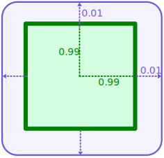

# Rigid-body simulation with contacts
The real-time simulation of rigid-bodies subjected to forces and contacts is the main feature of a physics engine for
video-games or animation. Rigid-bodies are typically used to simulate the dynamics of non-deformable solids as well
as to integrate the trajectory of solids whose velocities are controlled by the user (e.g. moving platforms). On
the other hand, rigid-bodies are not enough to simulate, e.g., cars, ragdolls, or robotic systems, as those use-cases
require adding restrictions on the relative motion between their parts with joints. Joints are the topic of
[the next chapter](joint_constraints_and_multibodies.md).

In this chapter, we first show how to initialize a [physics world](#initializing-the-physics-world) which will construct
all that is to be physically simulated and will drive the physics simulation. 

Then we introduce the [colliders](#colliders) which are geometric shapes responsible for generating contacts or simulating
sensors. Those colliders may be attached to [rigid-bodies](#rigid-bodies) which are responsible for the simulation of
the object trajectory under various forces including gravity. Colliders may also be attached to other kind of bodies
like multibodies and deformable bodies described in next chapters.

Finally, external forces can be applied to some bodies of the world by creating [force generators](#gravity-and-external-forces).

!!! Note "Terminology: **body** and **body part**"
    Throughout this guide, the term **body** is used to talk indifferently about rigid-bodies, multibodies and deformable
    bodies. The smallest constituent of a body is called a **body part**. Because a rigid-body is composed of a single
    indivisible piece, it is itself its only body part. A multibody however can be divided into several multibody links
    and each link is said to be a body part.

## Basic setup
First, let's see what is the minimum set of elements that must be setup to have an empty physical simulation up and running:

```rust
extern crate nalgebra as na;

use na::Vector3;
use nphysics3d::object::{DefaultBodySet, DefaultColliderSet};
use nphysics3d::force_generator::DefaultForceGeneratorSet;
use nphysics3d::joint::DefaultJointConstraintSet;
use nphysics3d::world::{DefaultMechanicalWorld, DefaultGeometricalWorld};

fn main() {
    let mut mechanical_world = DefaultMechanicalWorld::new(Vector3::new(0.0, -9.81, 0.0));
    let mut geometrical_world = DefaultGeometricalWorld::new();
    
    let mut bodies = DefaultBodySet::new();
    let mut colliders = DefaultColliderSet::new();
    let mut joint_constraints = DefaultJointConstraintSet::new();
    let mut force_generators = DefaultForceGeneratorSet::new();
    
    loop {
        // Run the simulation.
        mechanical_world.step(
            &mut geometrical_world,
            &mut bodies,
            &mut colliders,
            &mut joint_constraints,
            &mut force_generators
        )
    }
}
```

The physics engine is split into two _worlds_ which we will refer to as _"physics worlds"_:

1. The **geometrical world** which is responsible for geometric queries: collision-detection, ray-tracing, etc.
    Here the geometrical world has the type `DefaultGeometricalWorld<f32>` which is a type alias for the more generic
    `GeometricalWorld` type.
2. The **mechanical world** which is responsible for the simulation of physical phenomena: gravity, contact forces, joints, etc.
    Here the mechanical world has the type `DefaultMechanicalWorld<f32>` which is a type alias for the more generic
    `MechanicalWorld` type.

Those worlds will affect a set of elements: bodies, colliders, joints and force generators. Each of those elements come
into a separate data set:

- The `DefaultBodySet` is a set of all sort of bodies like rigid-bodies, multibodies as well as deformable bodies.
- The `DefaultColliderSet` is a set of colliders.
- The `DefaultJointConstraintSet` is a set of joints modeled with constraints.
- The `DefaultForceGeneratorSet` is a set of persistent force generators.

All those sets associate a unique handle to each element it contains. It is this handle that the dynamic and geometrical world
will end up storing on their internal data structure. That way, the worlds don't own the elements themselves, which is very
flexible as it allows, for example, to iterate through all the contact pairs stored by the geometrical world, and retrieve
at each iteration an immutable reference to a collider involved in the contact at the same time as a mutable reference to
the body it is attached to so you can apply a force to it. All this is possible without getting borrowing issues.

The subsequent sections provides more details on each of those element.

!!! Note
    All those types of sets have a name that begin by `Default`. This is because those are the sets can use if you don't
    have any reasons to define your own set data structure. If you need to use your own data structures are sets for
    physical elements, you have to implement the `BodySet` trait for sets of bodies, the `ColliderSet` trait for sets of
    colliders, the `JointConstraintSet` trait for sets of joint constraints, and the `ForceGeneratorSet` trait for sets
    of force generators. This can be useful when integrating nphysics to a larger system like an ECS or a game engine.

## Initializing the physics worlds
A working physics simulation requires to world structures to be created: the geometrical world and the mechanical world. The
**geometrical world** contains all the data structures and algorithms necessary to perform efficiently geometric operations like
computing sets of contacts between touching objects, detecting when two objects start interacting with each other, etc.
It is basically a wrapper around the data structures provided by the **ncollide2d** or **ncollide3d** [crate](https://ncollide.org).
A geometrical world can either be created with its default configuration:
 
```rust
let mut geometrical_world = DefaultGeometricalWorld::new();
```

or by manually giving it an instance of a broad-phase and a narrow-phase. This allows you to configure the them with
custom parameters and contact/proximity algorithm dispatchers:

```rust
// Build a broad-phase instance.
let broad_phase = DBVTBroadPhase::new(na::convert(0.01));
// Needed to build a narrow phase instance.
let coll_dispatcher = Box::new(DefaultContactDispatcher::new());
let prox_dispatcher = Box::new(DefaultProximityDispatcher::new());
// Build a narrow-phase instance.
let narrow_phase = NarrowPhase::new(coll_dispatcher, prox_dispatcher);

// Build the geometrical world.
let mut geometrical_world = DefaultGeometricalWorld::from_parts(broad_phase, narrow_phase);
```

The **mechanical world** contains all the data structures and algoritms necessary to perform efficiently the simulation of
physical phenomena like gravity, contact forces, deformations, etc. It can be constructed with a given gravity vector:

```rust
let gravity = Vector3::y() * -9.81;
let mut mechanical_world = DefaultMechanicalWorld::new(gravity);
```

The mechanical world has several fields you are free to change them if you need some specific configuration.
For example if the gravity has to be changed, simple do `mechanical_world.gravity = new_gravity;` and it will be taken into
account during subsequent timesteps. Keep in mind however, that it is discouraged to change the constraints solver once
you started performing timesteps (with the `.step` method) as you may cause some cashed data that improve stability and
performance to be reset. By default, the constraint solver handles contacts using the Signorini-Coulom contact model (to
enforce non-penetration with friction). This can be changed for other contact models dependending on your needs. Refer
to the dedicated [section](contact_models.md).


| Public field              | Description                                                  |
|--                         | --                                                           |
| `.counters`               | Various counters that measure internal performance of the physics engine. They are disabled by default. |
| `.solver`                 | The impulse-based constraints solver responsible for computing contact forces and fixing penetrations. |
| `.integration_parameters` | Parameters affecting the whole simulation. Find more details [there](/performance_tuning/#integration-parameters). |
| `.material_coefficients`  | A table that maps pairs of materials to material coefficients (for friction, restitution, and surface velocity). |
| `.gravity`                | The gravity affecting all dynamic bodies in the scene except those that are configured to ignore gravity. |

Once the physics world is created, the next step is to create some bodies that will take part of the simulation.


## Rigid-bodies
A rigid-body is the simplest type of body supported by **nphysics**. It can be seen as the aggregation of a position,
orientation, and mass properties (rotational inertia tensor, mass, and center of mass). It does not hold any information
regarding its shape which can optionally be specified by attaching one or multiple [colliders](/rigid_body_simulations_with_contacts/#colliders)
to it. A rigid-body with no collider will be affected by all the forces the world is aware of, including joints attached to it,
but not by contacts (because it does not have any shape that can be collided to).

### Creating a rigid-body
A rigid-body can only created by a `RigidBodyDesc` structure that is based on the builder pattern:


<ul class="nav nav-tabs">
  <li class="active"><a id="tab_nav_link" data-toggle="tab" href="#rigid_body_2D">2D example</a></li>
  <li><a id="tab_nav_link" data-toggle="tab" href="#rigid_body_desc_3D">3D example</a></li>
</ul>

<div class="tab-content" markdown="1">
  <div id="rigid_body_desc_2D" class="tab-pane in active">
```rust
use na::{Vector2, Point2, Isometry2};
use nphysics2d::object::{BodyStatus, RigidBodyDesc};
use nphysics2d::math::{Velocity, Inertia};

let rigid_body = RigidBodyDesc::new()
    // The rigid body translation.
    // Default: zero vector.
    .translation(Vector2::y() * 5.0)
    // The rigid body rotation.
    // Default: no rotation.
    .rotation(5.0)
    // The rigid body position. Will override `.translation(...)` and `.rotation(...)`.
    // Default: the identity isometry.
    .position(Isometry2::new(Vector2::new(1.0, 2.0), PI))
    // Whether or not this rigid body is affected by gravity.
    // Default: true
    .gravity_enabled(false)
    // The status of this rigid body.
    // Default: BodyStatus::Dynamic
    .status(BodyStatus::Kinematic)
    // The velocity of this body.
    // Default: zero velocity.
    .velocity(Velocity::linear(1.0, 2.0))
    // The linear damping applied to this rigid body velocity to slow it down automatically.
    // Default: zero (no damping at all).
    .linear_damping(10.0)
    // The angular damping applied to this rigid body velocity to slow down its rotation automatically.
    // Default: zero (no damping at all).
    .angular_damping(5.0)
    // The maximum linear velocity this rigid body can reach.
    // Default: f32::max_value() or f64::max_value() (no limit).
    .max_linear_velocity(10.0)
    // The maximum angular velocity this rigid body can reach.
    // Default: f32::max_value() or f64::max_value() (no limit).
    .max_angular_velocity(1.7)
    // The angular inertia tensor of this rigid body, expressed on its local-space.
    // Default: the zero matrix.
    .angular_inertia(3.0)
    // The rigid body mass.
    // Default: 0.0
    .mass(1.2)
    // The mass and angular inertia of this rigid body expressed in
    // its local-space. Default: zero.
    // Will override previous calls to `.mass(...)` and `.angular_inertia(...)`.
    .local_inertia(Inertia::new(1.0, 3.0))
    // The center of mass of this rigid body expressed in its local-space.
    // Default: the origin.
    .local_center_of_mass(Point2::new(1.0, 2.))
    // The threshold for putting this rigid body to sleep.
    // Default: Some(ActivationStatus::default_threshold())
    .sleep_threshold(None)
    // The translations that will be locked for this rigid body.
    // Default: nothing is locked (false everywhere).
    .kinematic_translations(Vector2::new(true, false))
    // The translations that will be locked for this rigid body.
    // Default: nothing is locked (false everywhere).
    .kinematic_rotation(true)
    // Whether this rigid body motion should be interpolated linearly during CCD resolution.
    // Default: false (which implies non-linear interpolation)
    .linear_motion_interpolation(true)
    // Arbitrary user-defined data associated to the rigid body to be built.
    // Default: no associated data
    .user_data(10)
    // All done, actually build the rigid-body.
    .build();
```
  </div>
  <div id="rigid_body_desc_3D" class="tab-pane">
```rust
use na::{Vector3, Point3, Isometry3, Matrix3};
use nphysics3d::object::{BodyStatus, RigidBodyDesc};
use nphysics3d::math::{Velocity, Inertia};

let rigid_body = RigidBodyDesc::new()
    // The rigid body translation.
    // Default: zero vector.
    .translation(Vector3::y() * 5.0)
    // The rigid body rotation.
    // Default: no rotation.
    .rotation(Vector3::y() * 5.0)
    // The rigid body position. Will override `.translation(...)` and `.rotation(...)`.
    // Default: the identity isometry.
    .position(Isometry3::new(Vector3::new(1.0, 2.0, 3.0), Vector3::y() * PI))
    // Whether or not this rigid body is affected by gravity.
    // Default: true
    .gravity_enabled(false)
    // The status of this rigid body.
    // Default: BodyStatus::Dynamic
    .status(BodyStatus::Kinematic)
    // The velocity of this body.
    // Default: zero velocity.
    .velocity(Velocity::linear(1.0, 2.0, 3.0))
    // The linear damping applied to this rigid body velocity to slow it down automatically.
    // Default: zero (no damping at all).
    .linear_damping(10.0)
    // The angular damping applied to this rigid body velocity to slow down its rotation automatically.
    // Default: zero (no damping at all).
    .angular_damping(5.0)
    // The maximum linear velocity this rigid body can reach.
    // Default: f32::max_value() or f64::max_value() (no limit).
    .max_linear_velocity(10.0)
    // The maximum angular velocity this rigid body can reach.
    // Default: f32::max_value() or f64::max_value() (no limit).
    .max_angular_velocity(1.7)
    // The angular inertia tensor of this rigid body, expressed on its local-space.
    // Default: the zero matrix.
    .angular_inertia(Matrix3::from_diagonal_element(3.0))
    // The rigid body mass.
    // Default: 0.0
    .mass(1.2)
    // The mass and angular inertia of this rigid body expressed in
    // its local-space. Default: zero.
    // Will override `.mass(...)` and `.angular_inertia(...)`.
    .local_inertia(Inertia::new(1.0, Matrix3::from_diagonal_element(3.0)))
    // The center of mass of this rigid body expressed in its local-space.
    // Default: the origin.
    .local_center_of_mass(Point3::new(1.0, 2.0, 3.0))
    // The threshold for putting this rigid body to sleep.
    // Default: Some(ActivationStatus::default_threshold())
    .sleep_threshold(None)
    // The translations that will be locked for this rigid body.
    // Default: nothing is locked (false everywhere).
    .kinematic_translations(Vector3::new(true, false, true))
    // The translations that will be locked for this rigid body.
    // Default: nothing is locked (false everywhere).
    .kinematic_rotations(Vector3::new(true, false, true))
    // Whether this rigid body motion should be interpolated linearly during CCD resolution.
    // Default: false (which implies non-linear interpolation)
    .linear_motion_interpolation(true)
    // Arbitrary user-defined data associated to the rigid body to be built.
    // Default: no associated data
    .user_data(10)
    // All done, actually build the rigid-body.
    .build();
```
  </div>
</div>

All the properties are optional. The only calls that are required are `RigidBodyDesc::new()` to initialize the builder,
 and `.build()` to actually build the rigid body. Note that a single builder can be re-used to build several
 rigid bodies. It is possible to change some of the builder properties with methods prefixed by `set_` before building
 another rigid body:
 
```rust
let mut rb_desc = RigidBodyDesc::new()
   .rotation(Vector3::new(1.0, 2.0, 3.0))
   .mass(1.2);

// Build a first rigid body.
let rigid_body1 = rb_desc.build();

// Change the rigid body translation and velocity before building
// another one. It will still have the same mass and rotation as
// initialized above.
let rigid_body2 = rb_desc.set_translation(Vector3::new(10.0, 0.0, 2.0))
       .set_velocity(Velocity::linear(1.0, 3.0, 0.0))
       .build();
```

Typically, the inertia and center of mass are automatically set to the inertia and center of mass resulting from the
shapes of the [colliders](#colliders) attached to the rigid-body, however this is not a requirement: you can for example
set the inertia and center of mass when building the rigid-body, and only attach to it colliders without density so
they don't contribute to this inertia and center of mass.

!!! Note
    The `.build()` method of the `RigidBodyDesc` returns the newly created rigid-body. It is
    still possible to further modify it after creation:
    
```rust
let mut rigid_body = RigidBodyDesc::new()
                        .translation(Vector3::x() * 2.0)
                        .build();
rigid_body.set_mass(10.0);
```

Once the rigid body is created it must be added to a body set. A body set is a container that maps a unique handle to
a body. The `DefaultBodySet` is the one to use unless you are using other tools (like a game engine) that require you to
work with their own body set.

```rust
let mut body_set = DefaultBodySet::new();
let handle = body_set.insert(rigid_body);
```

Upon insertion, the body set will return a handle to the rigid body. This will allow you to get a reference to this body
if needed later:

```rust
let rigid_body = body_set.rigid_body(handle);     // Retrieve an immutable reference.
let rigid_body = body_set.rigid_body_mut(handle); // Retrieve a mutable reference.
let body = body_set.get(handle);     // Retrieve an immutable reference of the rigid body seen as a Body trait-object.
let body = body_set.get_mut(handle); // Retrieve a mutable reference of the rigid body seen as a Body trait-object.
```

!!! Note
    No two bodies in the same body set can share the same handle. This handle is what you should store for future
    addressing of this rigid body as it is required by various operations  including: attaching colliders or constraints
    to the rigid-body.
    
!!! Warning
    The mechanical world and geometrical world will not be aware of bodies added or removed from the body set until the
    next call to `mechanical_world.step(...)`. Altenatively, you can call `mechanical_world.maintain(...)` in order to
    perform all the setup and cleanup tasks resulting from those body additions or removals without actually performing
    a timestep.

## Colliders
Colliders represent the geometric shapes that generate contacts and proximity events when they touch. A collider is
built by a `ColliderDesc` structure following the builder pattern:


<ul class="nav nav-tabs">
  <li class="active"><a id="tab_nav_link" data-toggle="tab" href="#collider_desc_2D">2D example</a></li>
  <li><a id="tab_nav_link" data-toggle="tab" href="#collider_desc_3D">3D example</a></li>
</ul>

<div class="tab-content" markdown="1">
  <div id="collider_desc_2D" class="tab-pane in active">
```rust
use na::{Vector2, Isometry2};
use ncollide2d::shape::{ShapeHandle, Ball};
use ncollide2d::world::CollisionGroups;
use nphysics2d::object::ColliderDesc;
use nphysics2d::material::{MaterialHandle, BasicMaterial};

let shape = ShapeHandle::new(Ball::new(1.5));
let collider = ColliderDesc::new(shape)
    // The collider translation wrt. the body part it is attached to.
    // Default: zero vector.
    .translation(Vector2::y() * 5.0)
    // The collider rotation wrt. the body part it is attached to.
    // Default: no rotation.
    .rotation(5.0)
    // The collider position wrt. the body part it is attached to.
    // Will override `.translation(...)` and `.rotation(...)`.
    // Default: the identity isometry.
    .position(Isometry2::new(Vector2::new(1.0, 2.0), PI))
    // The collider density. If non-zero the collider's mass and angular inertia will be added
    // to the inertial properties of the body part it is attached to.
    // Default: 0.0
    .density(1.3)
    // The material of this collider.
    // Default: BasicMaterial::default()
    // with restitution: 0.0, friction: 0.5, combine mode: Average.
    .material(MaterialHandle::new(BasicMaterial::new(0.3, 0.8)))
    // The solid margin surrounding this collider. Should always be non-zero.
    // Default: 0.01
    .margin(0.02)
    // The collision group this collider is part of and interacts with.
    // Default: part of all groups and interacts with all groups.
    .collision_groups(CollisionGroups::new()
                        .with_membership(&[1, 6])
                        .with_whitelist(&[1, 3, 5]))
    // The distance tolerance for predictive contacts generation.
    // Default: 0.002
    .linear_prediction(0.01)
    // The angular tolerance for predictive contacts generation.
    // Default: PI / 180.0 * 5.0
    .angular_prediction(0.1)
    // Whether this collider is a sensor, i.e., generate only proximity events.
    // Default: false
    .sensor(true)
    // Arbitrary user-defined data associated to the rigid body to be built.
    // Default: no associated data
    .user_data(10)
    // All done, actually build the collider into the `world`.
    .build(parent_body_part_handle);
```
  </div>
  <div id="collider_desc_3D" class="tab-pane">
```rust
use na::{Vector3, Isometry3};
use ncollide3d::shape::{ShapeHandle, Ball};
use ncollide3d::world::CollisionGroups;
use nphysics3d::object::ColliderDesc;
use nphysics3d::material::{MaterialHandle, BasicMaterial};

let shape = ShapeHandle::new(Ball::new(1.5));
let collider = ColliderDesc::new(shape)
    // The collider translation wrt. the body part it is attached to.
    // Default: zero vector.
    .translation(Vector3::y() * 5.0)
    // The collider rotation wrt. the body part it is attached to.
    // Default: no rotation.
    .rotation(Vector3::y() * 5.0)
    // The collider position wrt. the body part it is attached to.
    // Will override `.translation(...)` and `.rotation(...)`.
    // Default: the identity isometry.
    .position(Isometry3::new(Vector3::new(1.0, 2.0, 3.0), Vector3::y() * PI))
    // The collider density. If non-zero the collider's mass and angular inertia will be added
    // to the inertial properties of the body part it is attached to.
    // Default: 0.0
    .density(1.3)
    // The material of this collider.
    // Default: BasicMaterial::default()
    // with restitution: 0.0, friction: 0.5, combine modes: Average.
    .material(MaterialHandle::new(BasicMaterial::new(0.3, 0.8)))
    // The solid margin surrounding this collider. Should always be non-zero.
    // Default: 0.01
    .margin(0.02)
    // The collision group this collider is part of and interacts with.
    // Default: part of all groups and interacts with all groups.
    .collision_groups(CollisionGroups::new()
                        .with_membership(&[1, 6])
                        .with_whitelist(&[1, 3, 5]))
    // The distance tolerance for predictive contacts generation.
    // Default: 0.002
    .linear_prediction(0.01)
    // The angular tolerance for predictive contacts generation.
    // Default: PI / 180.0 * 5.0
    .angular_prediction(0.1)
    // Whether this collider is a sensor, i.e., generate only proximity events.
    // Default: false
    .sensor(true)
    // Arbitrary user-defined data associated to the colliders to be built.
    // Default: no associated data
    .user_data(10)
    // All done, actually build the collider into the `world`.
    .build(parent_body_part_handle);
```
  </div>
</div>

A `ColliderDesc` must be initialized with a collision shape (a `Ball` in this example). Possible shapes are
[planes](https://ncollide.org/geometric_representations/#plane), [balls](https://ncollide.org/geometric_representations/#ball),
[cuboids](https://ncollide.org/geometric_representations/#cuboid), [capsule](https://ncollide.org/geometric_representations/#capsule),
[heightfield](https://ncollide.org/geometric_representations/#cuboid), [convex polyhedra](https://ncollide.org/geometric_representations/#convex-hull),
[polylines](https://ncollide.org/geometric_representations/#polyline), [triangle meshes](https://ncollide.org/geometric_representations/#trimesh),
and [compound shapes](https://ncollide.org/geometric_representations/#compound).
All those structures are defined by the **ncollide2d** or **ncollide3d** crate.

All the colliders must be built by providing a handle to the body part they are attached to. See the
[next section](#collider-with-parent) for more information. Here are details about some of the configurable collider
properties:

* `density`: the density of the collider. This density is used to compute the collider shape's mass, center of mass,
and angular inertia which are then added to the attached body part's inertia properties.
* `margin`: the thickness that surrounds the collider's shape. This thickness is automatically added by **nphysics** for
performance and numerical accuracy reasons. Because this margin implicitly enlarges the shapes of colliders added to the
world, it can be useful to compensate it by adding a slightly smaller shape. For example, assume we want to add a cube
with half-extents all equal to 1.0. With a margin set to, e.g., 0.01, we could first create a slightly smaller cube:
`Cuboid::new(Vector3::repeat(1.0 - 0.01))` so that when the margin is added by **nphysics**, the half-extents will be
exactly 1.0 again:

<center>

</center>

* `position`: the position of the collider relative to its parent body part. At each timestep, the actual world-space
position of the collider is updated if its parent moved
* `material`: the [material](/rustdoc/nphysics3d/object/struct.Material.html) of the collider
describing the friction, restitution coefficient and surface velocity to be applied during contact resolution.

Once the collider is created it must be added to a collider set. A collider set is a container that maps a unique handle to
a collider. The `DefaultColliderSet` is the one to use unless you are using other tools (like a game engine) that require you to
work with their own collider set.

```rust
let mut collider_set = DefaultColliderSet::new();
let handle = collider_set.insert(collider);
```

Upon insertion, the collider set will return a handle to the collider. This will allow you to get a reference to this
collider if needed later:

```rust
let collider = body_set.get(handle);     // Retrieve an immutable reference.
let collider = body_set.get_mut(handle); // Retrieve a mutable reference.
```

!!! Note
    No two colliders in the same body set can share the same handle. This handle is what you should store for future
    addressing of this collider.
    
!!! Warning
    The mechanical world and geometrical world will not be aware of colliders added or removed from the collider set until the
    next call to `mechanical_world.step(...)`. In particular, the a collider with non-zero density won't affect the inertia
    properties of the body part it is attached to until the next timestep. Altenatively, you can call `mechanical_world.maintain(...)`
    in order to perform all the setup and cleanup tasks resulting from those collider additions or removals without actually performing
    a timestep.
    
### Collider with parent
Every collider must be attached to a body part by specifying the body part handle when building the collider:

```rust
let parent_rigid_body = RigidBodyDesc::new()
    .build(&mut world);
let parent_handle = body_set.insert(parent_rigid_body);

let shape = ShapeHandle::new(Ball::new(1.5));
let collider = ColliderDesc::new(shape)
    .density(1.0)
    .translation(Vector3::y() * 5.0)
    .build(BodyPartHandle(parent_handle, 0));
let collider_handle = collider_set.insert(collider);
```
    
In this example the body part handle we specified was `BodyPartHandle(parent_handle, 0)`. This means that the collider
will be attached to the first part (indexing of body parts starts at 0) of the body identified by `parent_handle`. A rigid
body always has one part. Other bodies like [multibodies](/joint_constraints_and_multibodies/#multibodies) are composed
of several body parts. Thus, attaching a collider to a multibody link requires specifying the index of the specific
link: `BodyPartHandle(parent_handle, link_index)` where `link_index` is an integer lying between 0 and the total number
of link the multibody has.

!!! Note
    If a collider is given a density, it will contribute to the mass and angular inertia of the body part it is
    attached to. This will take effect only after the next call to `mechanical_world.step(...)` or
    `mechanical_world.maintain(...)`.

The following shows a way to retrieve the handle of the body attached to a collider:

```rust
// Assuming `collider_handle` is a valid handle of a collider previously added to the world.
let collider = collider_set.get(collider_handle).expect("Collider not found.");
let body_handle = collider.body();
```

### Collision groups
It is possible to configure a subset of colliders to collide only with another subset of colliders. This is the goal of
**collision groups**. Collision groups are demonstrated on the [Collision groups](demo_collision_groups3) example where
only colliders with the same colors can collide with one another. The source-code of the demo is available on
[github](https://github.com/rustsim/nphysics/blob/master/examples3d/collision_groups3.rs). A collider's collision group
can be configured in a `ColliderDesc` before it is built into the physics world.

Because this is a feature from the **ncollide2d** and **ncollide3d** crates, an in-depth description of collision
groups is given in [that section](https://ncollide.org/collision_detection_pipeline/#collision-groups) of their
dedicated user guide.


## Body statuses
Any body can have one of four different statuses identified by the [`object::BodyStatus`](/rustdoc/nphysics3d/object/enum.BodyStatus.html)
enumeration:

* **`BodyStatus::Dynamic`:** This is the default status when creating any body. It indicates the body is affected by
    external forces, inertial forces (gyroscopic, coriolis, etc.) and contacts.
* **`BodyStatus::Static`:** Indicates the body cannot move. It acts as if it has an infinite mass and will not be
    affected by any force. It will continue to collide with dynamic bodies but not with static nor with kinematic
    ones. This is typically used for temporarily freezing a body.

!!! Note
    It is possible to attach all colliders that will never move to a body of type `Ground`. This body will always be static
    and have a position set to the identity. It will be slightly more memory-efficient and CPU-efficient than attaching thoses
    colliders to a rigid-body with a `Static` status.

* **`BodyStatus::Kinematic`:** Indicates the body velocity must not be altered by the physics engine. The user is
    free to set any velocity and the body position will be integrated at each update accordingly. This is typically
    used for **platforms** as shown in [that demo](/demo_body_status3/).
* **`BodyStatus::Disabled`:** Indicates the body should be completely ignored by the physics engine. In practice,
    this will remove all contacts this body is involved with and disable (but not remove) all joint constraints
    attached to it.

For example, to change the status of a rigid-body, you need to retrieve a mutable reference to it and then call the
`.set_status(...)` method:

```rust
let mut rb = body_set.get_mut(handle).expect("Rigid-body not found.");
rb.set_status(BodyStatus::Kinematic);
// Sets the velocity of the kinematic rigid-body.
rb.set_velocity(Velocity::linear(0.0, 0.0, 1.0));
```

Note that those statuses can also be applied to other types of bodies, including
[multibodies](/joint_constraints_and_multibodies/#multibodies) and [deformable bodies](/deformable_bodies/).

## Kinematic degrees of freedom
Some bodies allow to mark only some of their degrees of freedom as kinematic. For example:

* It is possible to mark as kinematic some translations or rotations of a rigid body. This is useful to prevent
  all translations and/or rotations wrt. some specific coordinate axises, or to control them at the velocity level.
  This is achieved by the `.kinematic_translations` and `kinematic_rotations` modifiers at construction-time, or by
  the `.set_translations_kinematic` and `.set_rotations_kinematic` methods after construction:
  
```rust
let rigid_body = RigidBodyDesc::new()
    // Translations along the y and z axises will be locked and controllable at the
    // velocity level by the user.
    .kinematic_translations(Vector3::new(false, true, true));
    .velocity(Velocity::linear(1.0, 0.0, 3.0))
    .build();
    
// NOTE: the velocity of the rigid body along the `y` and `z` axis will remain
// constant independently from any forces. Therefore this body will be fixed
// in translation wrt the `y` axis, and will translate with a velocity of `3.0`
// along the `z` axis.
```

This second example changes the kinematic degrees of freedom of a rigid body after its creation and addition to the body
set, using its handle. Now the translations along `x` as well as rotations wrt. the axis `x` and `z` will be locked and
controllable at the velocity level:

```rust
let rb = body_set.rigid_body_mut(handle).expect("Rigid body not found");
rb.set_translations_kinematic(Vector3::new(true, false, false))
rb.set_rotations_kinematic(Vector3::new(true, false, true));
```

!!! Note "Rigid bodies that cannot rotate"
    It can be useful to prevent a rigid-body from rotating at all, e.g., for the player entity of a video game.
    This can be achieved by setting all its rotations as kinematic, or, equivalently, by calling
    `.disable_all_rotations()` on the rigid body. Note that `.disable_all_rotations()` will also set the rigid-body
    angular velocity to zero in addition to marking all its rotational degrees of freedom as kinematic.
  
* It is possible to mark some nodes of a deformable body as kinematic so that those nodes remain fixed in space or can
  be controlled by the user at the velocity level. See the [deformable bodies](/deformable_bodies/) section.
  
!!! Note ""Controllable at the velocity level""
    We used the term **controllable at the velocity level** multiple times here. This means it is still possible for the
    user to set a non-zero velocity to a kinematic body or a dynamic body with kinematic degrees of freedom. A kinematic
    body or the kinematic degrees of freedoms will keep this velocity constant no matter what. This is useful for platform
    that should have a specific trajectory without being disturbed by any force of the world. Of course, the user can
    still modify this trajectory by changing the velocity of those kinematic elements at any time.


## Gravity, forces, and impulses
There are three ways of applying forces to a body in **nphysics**. The most common force is the gravity and
is treated as a special case by **nphysics**. Other permanent external forces can be simulated using
[force generators](#permanent-force-generators). Finally, forces, impulses, and instantaneous velocity or acceleration
changes can be [applied](#one-time-force-application-and-impulses) for a single timestep to each body part individually.

### Gravity
Because the gravity is such a common force, it is a special case within **nphysics**.
It is set at the creation of the mechanical world and can be changed later with the mechanical world's
`.gravity` public field:

```rust
let mut mechanical_world = MechanicalWorld::new();
mechanical_world.gravity = Vector3::y() * -9.81; // or Vector2 in 2D.
```

Even though the gravity automatically affect all the dynamic bodies, it is possible to cancel the effect of the gravity
on a specific body:

* By disabling gravity for this body before it is constructed by calling the `.gravity_enabled(false)` setter. Example:

```rust
let mut rigid_body = RigidBodyDesc::new()
   // ... other initialization accessors.
   // Disable gravity for rigid bodies built by this RigidBodyDesc.
   .gravity_enabled(false)
   .build();
```
  
* Or by calling `body.enable_gravity(false)` on a body that has already been created into the physics world. This
    `.enable_gravity` method is part of the [`Body`](https://www.nphysics.org/rustdoc/nphysics3d/object/trait.Body.html)
    trait:
    
```rust
let mut rb = body_set.body_mut(rb_handle).expect("Rigid body not found.");
rb.enable_gravity(false);
```

### Permanent force generators
Other external forces can also be applied to the bodies on the physics world. This is what
[`ForceGenerators`](/rustdoc/nphysics3d/force_generator/trait.ForceGenerator.html) are for. A force generator is a
structure implementing the `ForceGenerator` trait which requires one method: `.apply(params, bodies)`. The `params` is
a reference to [integration parameters](/performance_tuning/#integration-parameters) allowing you to retrieve, e.g., the
timestep duration (in seconds) for the current update of the physical world with `params.dt()`, or the total time `params.t`
elapsed in the physics world since its creation. The `bodies` parameter allows you to retrieve mutable references to the
rigid-bodies to be affected by the force generator. The following example shows the definition of a generator of a radial
force proportional to the position of a body wrt. a point:

<ul class="nav nav-tabs">
  <li class="active"><a id="tab_nav_link" data-toggle="tab" href="#force_generator_2D">2D example</a></li>
  <li><a id="tab_nav_link" data-toggle="tab" href="#force_generator_3D">3D example</a></li>
</ul>

<div class="tab-content" markdown="1">
  <div id="force_generator_2D" class="tab-pane in active">
```rust
use na::Point2;
use nphysics2d::solver::IntegrationParameters;
use nphysics2d::force_generator::ForceGenerator;
use nphysics2d::object::{BodyPartHandle, BodySet};
use nphysics2d::math::{Force, ForceType};

pub struct RadialForce {
    parts: Vec<BodyPartHandle>, // Body parts affected by the force generator.
    center: Point2<f32>,
}

impl RadialForce {
    // Creates a new radial force generator.
    pub fn new(center: Point2<f32>, parts: Vec<BodyPartHandle>) -> Self {
        RadialForce {
            parts,
            center,
        }
    }

    /// Add a body part to be affected by this force generator.
    pub fn add_body_part(&mut self, body: BodyPartHandle) {
        self.parts.push(body)
    }
}

impl ForceGenerator<f32> for RadialForce {
    fn apply(&mut self, _: &IntegrationParameters<f32>, bodies: &mut BodySet<f32>) -> bool {
        for handle in &self.parts {
            // Generate the force only if the body has not been removed from the world.
            if let Some(body) = bodies.body_mut(handle.0) {
                let part = body.part(handle.1).unwrap();

                let delta_pos = part.center_of_mass() - self.center;

                // We set the attraction force such that it is equal to ten times the distance
                // between the body part and self.center.
                let force = Force::linear(delta_pos * -10.0);

                // Apply the force.
                body.apply_force(handle.1, &force, ForceType::Force, false);
            }
        }

        // If `false` is returned, the physis world will remove
        // this force generator after this call.
        true
    }
}
```
  </div>
  <div id="force_generator_3D" class="tab-pane">
```rust
use na::Point3;
use nphysics3d::solver::IntegrationParameters;
use nphysics3d::force_generator::ForceGenerator;
use nphysics3d::object::{BodyPartHandle, BodySet};
use nphysics3d::math::{Force, ForceType};

pub struct RadialForce {
    parts: Vec<BodyPartHandle>, // Body parts affected by the force generator.
    center: Point3<f32>,
}

impl RadialForce {
    // Creates a new radial force generator.
    pub fn new(center: Point3<f32>, parts: Vec<BodyPartHandle>) -> Self {
        RadialForce {
            parts,
            center,
        }
    }

    /// Add a body part to be affected by this force generator.
    pub fn add_body_part(&mut self, body: BodyPartHandle) {
        self.parts.push(body)
    }
}

impl ForceGenerator<f32> for RadialForce {
    fn apply(&mut self, _: &IntegrationParameters<f32>, bodies: &mut BodySet<f32>) -> bool {
        for handle in &self.parts {
            // Generate the force only if the body has not been removed from the world.
            if let Some(body) = bodies.body_mut(handle.0) {
                let part = body.part(handle.1).unwrap();

                let delta_pos = part.center_of_mass() - self.center;

                // We set the attraction force such that it is equal to ten times the distance
                // between the body part and self.center.
                let force = Force::linear(delta_pos * -10.0);

                // Apply the force.
                body.apply_force(handle.1, &force, ForceType::Force, false);
            }
        }

        // If `false` is returned, the physis world will remove
        // this force generator after this call.
        true
    }
}
```
</div>
</div>

Two forces generators are currently implemented in **nphysics**:

2. The [ConstantAcceleration](/rustdoc/nphysics3d/force_generator/struct.ConstantAcceleration.html) force generator 
applies a linear and angular force at the center of mass of some specified body parts. The force is such that the linear
and angular accelerations specified at the construction of this force generator are added to the affected bodies.
1. The [Spring](/rustdoc/nphysics3d/force_generator/struct.Spring.html) applies opposite forces to two bodies. The forces
magnitudes are proportional to the distance between the bodies.

### One-time force application and impulses
It is possible to apply a force to any body part, at any of its points. In the following, let us call $~f$ a force we
apply at the center of mass of a body part. We distinguish four kinds of forces listed in the `ForceType` enum:

* `ForceType::Force`: a force as in the formula $~f = mass × acceleration$. Applying this force to a body will
   add a velocity of $~\frac{f}{mass} × dt$ (where $~dt$ is the time step length) to the body part's velocity at the next 
   timestep.
* `ForceType::AccelerationChange`: a direct acceleration change that will add $~f × dt$ to the body part's velocity at the next timestep.
* `ForceType::Impulse`: an impulsive force that immediately adds $~\frac{f}{mass}$ to the body part's velocity.
* `ForceType::VelocityChange`: a direct velocity change that immediately adds $~f$ to the body part's velocity.

!!! Note
    All forces applied to a body part are cleared during the next timestep. Therefore a persistent force
    should be re-applied at each frame.
    
Several methods of the `Body` trait can be called in order to apply a force to a body part:
    
```rust
use nphysics2d::math::{Force, ForceType}; // For 2D
use nphysics3d::math::{Force, ForceType}; // For 3D

// Force application at the body part's center of mass.
fn apply_force(&mut self, part_id: usize, f: &Force<N>, force_type: ForceType, auto_wake_up: bool);
fn apply_local_force(&mut self, part_id: usize, f: &Force<N>, force_type: ForceType, auto_wake_up: bool);

// Force application at a custom point on the body part.
fn apply_force_at_point(&mut self, part_id: usize, f: &Vector<N>, point: &Point<N>, force_type: ForceType, auto_wake_up: bool);
fn apply_local_force_at_point(&mut self, part_id: usize, f: &Vector<N>, point: &Point<N>, force_type: ForceType, auto_wake_up: bool);
fn apply_force_at_local_point(&mut self, part_id: usize, f: &Vector<N>, point: &Point<N>, force_type: ForceType, auto_wake_up: bool);
fn apply_local_force_at_local_point(&mut self, part_id: usize, f: &Vector<N>, point: &Point<N>, force_type: ForceType, auto_wake_up: bool);
```

Every method takes very similar arguments among which:

* **part_id** is the index of the body's part you want to apply the force to. For rigid bodies, this argument should be
zero since a rigid body has only one part.
* **auto_wake_up** controls whether the body affected by the force should be waken-up automatically because of this force
  application. This should typically be set to `true` whenever you are applying a one-time force manually. This should
  likely be set to `false` if you are applying a continuous force from a force generator (so that bodies reaching a dynamic
  equilibrium can be put to sleep again).


## Running the simulation
To compute new positions and velocities of the various bodies on the physical world, you have to call the
`mechanical_world.step(...)` method. Typically, a game loop will look like this:

```rust
loop {
    handle_input_events();
    mechanical_world.step(
                &mut geometrical_world,
                &mut body_set,
                &mut collider_set,
                &mut constraint_set,
                &mut force_generator_set,
            );
    handle_physics_events();
    render_scene();
}
```

Physics events are detailed on a dedicated [page](interaction_handling_and_sensors.md) of this guide. One physics step
will detect contacts between the colliders, generate contact points, compute forces accordingly, and update the positions
of all bodies. Forces taken into account by **nphysics** are:

* Contact forces due to impacts between colliders.
* Gravity and force generators presented in the previous [section](/rigid_body_simulations_with_contacts/#gravity-and-external-forces).
* Gyroscopic and coriolis forces due to rotations and the non-linear nature of multibody joints parametrization.

Each call to `mechanical_world.step(...)` will advance the simulation by a time equal to $1/60$ seconds, which is adapted if your
application has a refresh rate of 60Hz. The length of this timestep can be retrieved by `mechanical_world.timestep()` and modified
using `mechanical_world.set_timestep(...)`. Note that if you use SI units, i.e., the
[International System of Units](https://en.wikipedia.org/wiki/International_System_of_Units), this timestep is to be
given in seconds. Keep in mind that the timestep length strongly affects the accuracy of the simulation: the smaller the
timestep, the more accurate the simulation will be.
